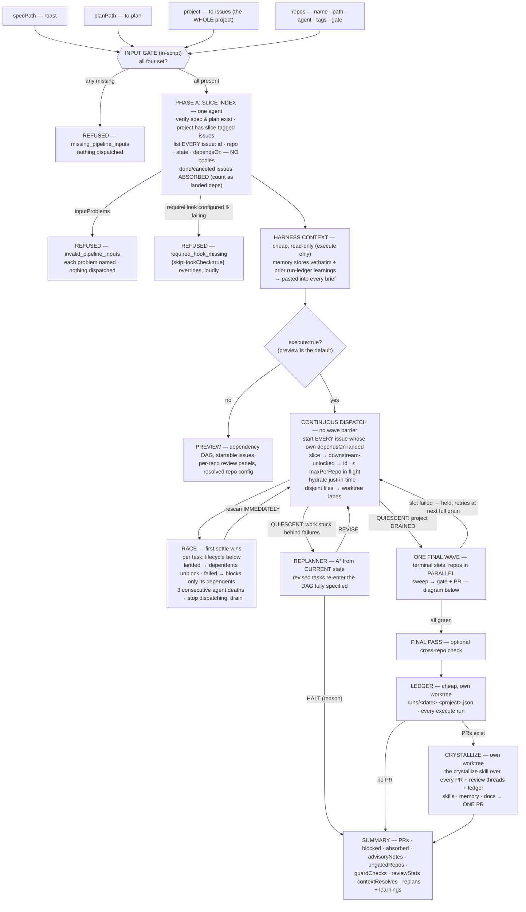
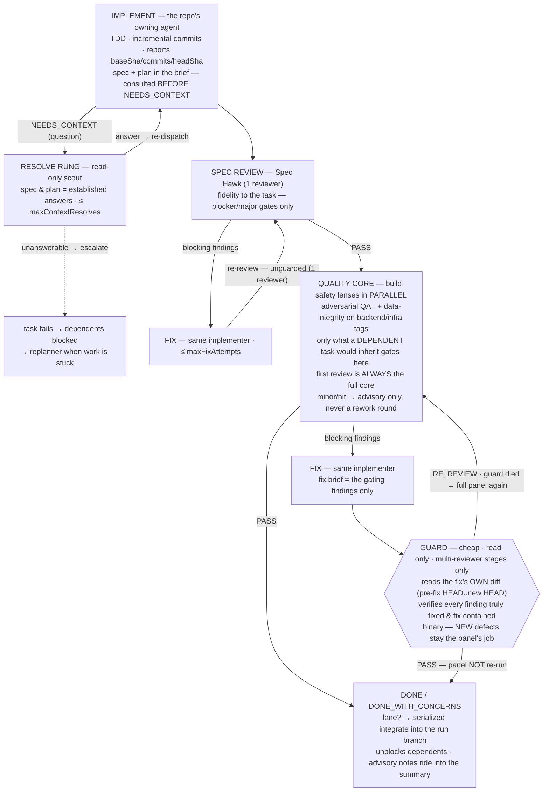
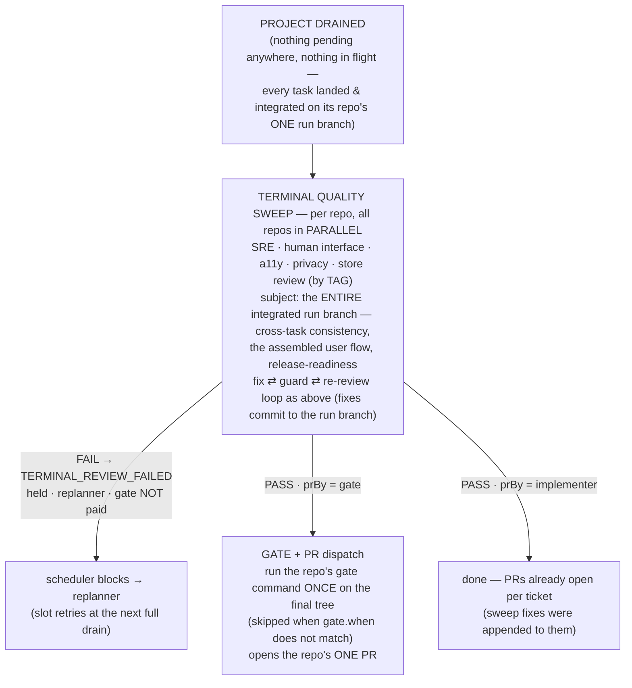

# orchestrate-loop — the unattended build loop

`roast` → `to-plan` → `to-issues` is the design half of the pipeline. This is the build
half, codified as a [dynamic workflow](https://code.claude.com/docs/en/workflows) script: it
takes the three artifacts the design half produced and runs the whole project to PRs on its
own — implementing each issue, reviewing it through a diverse-lens panel, gating the final
tree, opening one PR per repo, and learning from what happened.

It is stack-agnostic. Every repo, agent, checkout path, gate command, tracker and directory
arrives through `args`; nothing about a language, framework, CI system or product is baked
into the script. The prose every dispatched agent reads lives next to it in `briefs/*.md` and
`personas/*.md`, so you can edit the behaviour without touching the engine.

## Install

Drop `workflows/orchestrate-loop.js` into `.claude/workflows/` (project) or
`~/.claude/workflows/` (personal), and put `briefs/` and `personas/` where you like — then
tell the script where they are with `{briefsDir, personasDir}`. Run it as `/orchestrate-loop`.

## Invoke

```js
/orchestrate-loop {
  specPath: 'docs/specs/2026-09-17-checkout-rework.md',   // from roast
  planPath: 'docs/plans/2026-09-17-checkout-rework.md',   // from to-plan
  project:  'PROJ-600',                                   // from to-issues
  repos: [
    { name: 'api',    agent: 'backend-engineer', tags: ['backend'],
      gate: { kind: 'command', run: 'make e2e ARGS=--wait', stamp: 'tests/e2e/.green' },
      timeoutMin: 60 },
    { name: 'mobile', agent: 'app-engineer',     tags: ['mobile'],
      gate: { kind: 'command', run: 'npm run smoke', stamp: 'native/.smoke-green',
              note: 'rebuild the vendored native artifacts and commit them first',
              when: { pathsMatching: ['native/', 'modules/native-bridge/'] } } },
    { name: 'infra',  agent: 'infra-engineer',   tags: ['infra'], gate: null },
  ],
  execute: true,   // omit for a preview — the default
}
```

**Previews by default.** Without `{execute:true}` the run stops after the index and returns
the dependency DAG, which issues are startable, the review panel each repo would draw, and
the resolved repo config. Nothing is dispatched. A forgotten or malformed flag therefore
fails safe.

## Inputs

| Input | Required | What it is |
| ----- | -------- | ---------- |
| `specPath` | yes | the approved spec from `roast` |
| `planPath` | yes | the plan from `to-plan` |
| `project` | yes | the slice-tagged project or parent ticket from `to-issues` (an opaque id — Jira, Linear, GitHub Issues, or other) |
| `repos` | yes | the repo table; see below |
| `execute` | — | `true` to dispatch; default is a preview |

Missing any of the four → `missing_pipeline_inputs`, nothing dispatched. Failing the index
agent's verification (spec or plan absent/empty, no slice-tagged issues) →
`invalid_pipeline_inputs` via `inputProblems`. There are no fallback sources: a pre-extracted
task list would bypass `roast`, which is the point of requiring the artifacts.

### `repos[]`

| Field | Default | Meaning |
| ----- | ------- | ------- |
| `name` | — | the repo name the tracker issues use |
| `agent` | — | the subagent type that owns this repo's implementation |
| `path` | `repositories/<name>` | the checkout every command runs against |
| `tags` | `[]` | drives **persona selection**: `backend`, `mobile`, `web`, `infra`, or your own |
| `gate` | `null` | the command that certifies the final tree; see below |
| `prBy` | `'gate'` if a gate exists, else `'implementer'` | who opens the PR |
| `timeoutMin` | the global `agentTimeoutMin` | a longer hang backstop for this repo's dispatches (a gate that queues for a shared lock) |
| `laneSetup` | — | a shell line run when a parallel lane's worktree is created; `<lane>` is substituted with the worktree path (e.g. symlinking `node_modules`) |

### `repos[].gate`

```js
gate: {
  kind: 'command',
  run: 'make e2e ARGS=--wait',        // run ONCE, on the final reviewed tree
  stamp: 'tests/e2e/.green',          // optional: a tree-hash stamp file the command writes
  note: 'rebuild X and commit first', // optional: extra instruction for the gate dispatch
  when: { pathsMatching: ['native/'] }, // optional: only gate when the RUN touched a match
}
```

`when.pathsMatching` is evaluated against everything the run touched **in that repo** —
planned `files` plus the `filesChanged` every implementer and every review fix reported —
because a pre-PR hook's unit is the whole branch, not one task. Absent means the gate always
runs. Matching is substring containment and deliberately loose: a false positive costs one
gate run, a false negative gets the PR blocked by your own hook.

`gate: null` means no gate command; the repo's PRs are opened per ticket by its implementers
as they go, and its terminal slot ends at the quality sweep.

### Optional knobs

| Input | Default | Meaning |
| ----- | ------- | ------- |
| `maxPerRepo` | `3` | tasks in flight per repo (`1` restores strict serialization) |
| `maxFixAttempts` | `3` | fix rounds per review stage before it returns FAIL |
| `maxReplans` | `3` | replans before the run halts |
| `maxContextResolves` | `2` | scout-answered `NEEDS_CONTEXT` questions per dispatch (`0` escalates immediately) |
| `agentTimeoutMin` | `40` | per-agent hang backstop (`0` disables) |
| `memoryDir` | `memory` | `harness.md` + `agents/<agent>.md` |
| `runsDir` | `runs` | where run ledgers are written |
| `briefsDir` | `workflows/briefs` | where the dispatch briefs live |
| `personasDir` | `workflows/personas` | where the review lenses live |
| `worktreeDir` | `.worktrees` | where parallel lanes are checked out |
| `baseBranch` | `origin/main` | the integration branch lanes branch from and reviews/sweeps diff against (`origin/master`, `origin/trunk`, …) |
| `requireHook` | `null` | `{name, check, fix?}` — refuse to execute unless a tool hook is installed and registered in this session |
| `skipHookCheck` | `false` | explicit, logged escape hatch for `requireHook` |
| `precheck` | `true` | the haiku structural check between implementer and panel (`false` disables) |
| `maxPrecheckFixes` | `1` | fix dispatches a precheck FAIL may buy before the task fails as `PRECHECK_FAILED` |
| `verifyFindings` | `true` | verify each gating finding against the code before a fix is bought (`false` disables) |
| `escalateAtFixRound` | `2` | from this fix round on, the implementer runs on opus whatever tier was chosen (`0` disables) |
| `specialists` | `[]` | `[{agent, repos: ['*'] \| [names], use}]` — implementers the selector may route a repo's tasks to instead of its owner |
| `agentNamespace` | `'grimoire'` | the prefix of the plugin-shipped agents (`agents/*.md`): the reviewer, the scouts, the `finalCheck` default and plugin specialists dispatch as `<ns>:<name>` (`grimoire:reviewer`). `''` keeps bare names, for a project that copied `agents/` into its own `.claude/agents/`. Repo/team agents, project-defined specialists and names that already contain `:` are used as given; memory stays at `agents/<bare name>.md` |
| `tracker` | — | `{kind?, tools, note?}` — the tools that reach the tracker, e.g. `{kind: 'linear', tools: 'mcp__<server-id>__*', note: 'the claude.ai Linear connector'}`. Pasted into the header of every dispatch that reads or writes the tracker (index · hydrate · claim/release · replan) so it uses that connector instead of a server picked by its name. Unset, those briefs prefer an authenticated connector and look for other tracker tools before reporting a problem |
| `maxOutputTokens` | — | cost fuse: this run's output tokens, counted across resumed sessions; reaching it halts as `budget_exhausted` |
| `budgetFloor` | `80000` | stop dispatching when the turn's remaining token budget drops below this |
| `claim` | — | `{identity}` — claim issues at hydration, never build one someone else started, release what did not land |
| `telemetry` | `{enabled: true}` | the decision journal: `{enabled, dir: '.grimoire/runs', flushEvery: 40}` (`retentionDays` is read by `/grimoire:logs`) |
| `runId` · `runMeta` | set by `/orchestrate` | the journal directory name, and `{grimoireVersion, briefsHash, personasHash, configHash}` every event of the run is tagged with |
| `resumeState` | — | the `checkpoint` from an earlier session's `run.json`, so a new session keeps the replans, fix rounds, learnings, sequence and spend already used |
| `guard` | — | not read by the loop: the `PreToolUse` guard hook's config (`hooks/README.md`) |
| `graph` | `{enabled: true}` | not read by the loop: the code graph's config, `{enabled, repos?, dir: '.grimoire/graph', exclude?, maxFileKB: 512}` (`tools/graph/README.md`); scouts use it for research, never for what code does |

The canonical `requireHook` is [rtk](https://github.com/rtk-ai/rtk), which condenses every Bash result before it reaches an agent: `{ name: 'rtk hook claude', check: 'command -v rtk && rtk hook check "git status" | grep -q "^rtk "', fix: 'brew install rtk-ai/tap/rtk && rtk init -g' }`. A run that would dispatch dozens of agents without it reads raw output everywhere, so refusing is cheaper than running.
| `finalCheck` | `null` | `{repos:[…], prompt, agentType?}` — one read-only cross-repo check when every named repo landed work (e.g. API-contract drift between a client and its server) |

## How a run flows



Replans, terminal slots and halts happen **only at quiescence** (nothing in flight) — the
coherence a wave barrier used to provide, without its idle time. A token-budget floor stops
dispatching, lets in-flight work settle, then halts cleanly; re-invoking the same project
resumes, because landed issues are absorbed via their tracker state, and any repo a halt left
without its gate/PR is listed in `ungatedRepos`.

### One task's lifecycle



### The final wave



The sweep runs **before** the gate so its fix commits land before any tree-hash stamp is
paid. A sweep or gate failure is a regular failure: the replanner can queue a repair task, and
the slot retries at the next full drain.

## Why it is shaped this way

**Reviews are split by scope.** A landed task unblocks its dependents, so per-task review
gates exactly what a dependent would inherit: fidelity (Spec Hawk) plus a build-safety core
(adversarial QA, and data-integrity on backend/infra-tagged repos). The polish and compliance
lenses judge the *integrated* feature, so they run once per repo, at project end, over the
whole run branch. Implementation never pays a gate.

**Severity is the gate, not the verdict flag.** Only `blocker` and `major` buy a rework
round — each one is a full implementation dispatch. `minor` and `nit` are collected and
reported in `advisoryNotes`, never reworked. A reviewer that returns FAIL with no finding at
all is unverifiable, so it gates anyway, carrying its summary as a synthesized major.

**The guard exists because re-reviews are expensive.** The first review of a stage is always
the full panel; after a fix, one cheap agent reads the fix's own diff and either passes the
stage or sends it back to the panel. It is binary on purpose — finding *new* defects stays the
panel's job.

**Failures are information.** A failed issue blocks only its dependents. When the scheduler is
stuck, the replanner searches from the current state rather than restarting the original plan,
and returns `learnings` that are folded into every later hydration and into the run ledger the
next run reads. See the `adaptive-replanning` skill.

**Parallelism comes from declared files.** `dependsOn` decides what is *ready*; declared
`files` decide what may run *together* in one repo. Disjoint footprints get their own worktree
lane; overlap, or an undeclared footprint, is held until the conflict clears. Lane merges into
the repo's single run branch are serialized, and a merge conflict is a first-class
`MERGE_CONFLICT` failure routed to the replanner — a reviewed diff is never silently
rewritten.

## The rungs added around the panel

**Precheck.** Between the implementer and the first review, one haiku dispatch
(`briefs/precheck.md`) checks that there is something reviewable: a commit range, a non-empty
diff, no conflict or stub markers added, tests moved with behaviour, no undeclared files, no
stray artifacts. A FAIL goes back to the same implementer (`maxPrecheckFixes`), before any
reviewer is paid. A dead precheck passes through — it is an optimisation, not a gate.

**Finding verification.** Every failing review round sends its gating findings to one sonnet
verifier (`briefs/verify.md`) before a fix is bought. A finding is overturned only when the
verifier cites the code that proves it false; overturned findings are reported in
`overturnedFindings`, never reworked. A dead verifier keeps every finding.

**The selector.** Hydration already reads each issue in full, so it also routes it: `agent`
(the repo's owner, or a specialist enabled for that repo) × `model` (haiku · sonnet · opus by
the rubric in `briefs/hydrate.md`) with a `routeReason`. The engine accepts only an agent the
routing table allows — anything else is dispatched as the owner, counted as a fallback — and
escalates to opus from `escalateAtFixRound` and for every replanned task. Only review fix
rounds count toward escalation; a precheck fix is structural and does not. `NEEDS_CONTEXT`
questions go to the scout their shape calls for: contract → `contract-checker`, security →
`security-scout`, performance → `perf-scout`, otherwise `codebase-scout`.

**Learnings by relevance.** Learnings are stored as `{text, repos}`. Each hydration carries
at most 12: those about its own repos first, then pipeline-wide ones — not the last N of
everything. Older ledgers' bare strings are tagged with that ledger's repos.

**Claims.** With `claim.identity`, the index reports each issue's assignee; an issue someone
else has started is never dispatched (its dependents wait, `claimedElsewhere` says why);
hydration assigns the issues it is about to build (a replan that re-enters an unclaimed
tracker issue claims it through `briefs/claim.md`); at the end one dispatch
(`briefs/claim.md`) hands back every claimed issue that did not land.

**Cost fuse.** `maxOutputTokens` is checked before every dispatch, counting what earlier
sessions of the same run spent. At 80% the run logs a warning; at the cap it stops
dispatching, lets in-flight work settle and halts as `budget_exhausted`. The script only
sees output tokens (`budget.spent()`); input and cache tokens are not visible to it.

## The decision journal

Every decision is an event: `run.start`, `route`, `dispatch`, `precheck`, `review` (one per
reviewer), `verify`, `fix`, `escalate`, `guard`, `resolve`, `integrate`, `settle`, `replan`,
`terminal`, `gate`, `claim`, `budget`, `halt`, `run.end`. Each carries a gap-free `seq`, the
cumulative output tokens `tok`, and its fields (reasons included). The script has no clock
and no filesystem, so events are buffered and one haiku writer per chunk (`briefs/journal.md`)
runs a fixed shell script that:

- writes the chunk to `<telemetry.dir>/<runId>/events/<first seq>.jsonl` — a retried or
  replayed flush overwrites the same file, never appends duplicates;
- stamps wall time into each line (`at`) in the shell;
- rewrites `run.json`: `runId`, `project`, `meta`, `status`, `summary`, and the `checkpoint`
  a new session resumes from;
- prints the line and byte counts, which the engine compares with what it sent — a
  mismatch is logged and counted, never trusted.

Chunks flush every `flushEvery` events, at every replan, before the final wave and at the
end (before the ledger, so `crystallize` can read the finished journal). The directory is
local and gitignored; `/grimoire:logs` renders it, and its `summary` is the cross-run evidence
`crystallize` reads, grouped by grimoire version and briefs hash.

## What it returns

`done` · `needsAttention` · `blocked` (never ran) · `alreadyDone` (absorbed) · `deferred` ·
`advisoryNotes` (the minor/nit findings not reworked — triage them by hand) · `ungatedRepos`
(landed work with no PR yet) · `prs` · `replans` + `learnings` + `halt` · `contextResolves`
(every `NEEDS_CONTEXT` question, who answered it, which escalated — a high count means the
spec was underspecified, take it back to `roast`) · `guardChecks` · `reviewStats` ·
`precheckStats` · `overturnedFindings` · `routing` (picks by agent and model, fallbacks,
escalations) · `claimedElsewhere` · `claimsReleased` · `meta` · `telemetry` (output tokens,
this run's spend against `maxOutputTokens`, and the journal's receipt) · `harness` (the ledger
written and what crystallize produced).

The run stops at PRs. Merging and deploying stay yours.

## Tests

The scripts only run inside the Workflow runtime, where every step costs real agents. The
tests reimplement the runtime's contract (`agent`, `parallel`, `log`, `phase`, `args`,
`budget`) with scripted stubs, so the whole control flow executes in milliseconds and asserts
the actual dispatches — which agents ran, in what order, with which prompt.

```sh
for t in workflows/tests/*.test.mjs; do node "$t"; done
```

Their repos are fixtures (`api`, `mobile`, `infra`), not product facts. Add a case by calling
`run(name, tasks, responder)` and returning whatever each dispatch should have returned.

## Runtime constraints worth knowing

The script has **no filesystem or shell access** — agents read, write and run commands; the
script only coordinates them. It cannot call `Date.now()`, `Math.random()` or `new Date()`
(the runtime makes them throw so a relaunched run replays identically), and it cannot
`import()`. That is why the review range travels as SHAs in the implementer's structured
return, and why memory and ledgers are read and written by dedicated cheap agents.

## Token economy (built in)

- The terminal sweep reads **by lens**: each persona takes the branch `--stat` and reads only the files its Scope section names, never the whole branch.
- Mechanical dispatches (index, harness-context, integrate, precheck, journal, claim release, ledger) run with `effort: 'low'`; index and hydration run on sonnet, the replanner stays on opus, and implementers run on the tier the selector picked (opus when unset).
- A precheck stops an unreviewable diff before the panel; a verifier stops a false-positive finding before it buys a fix.
- The first review of a stage is the full panel; after a fix a sonnet guard decides whether the panel re-runs.
- Briefs and memory are pasted as a stable prefix so prompt caching hits across dispatches; volatile values (task, SHAs) come last.
- `requireHook` (rtk) refuses to execute without output compression.
- After a halt, resume with `resumeFromRunId`; cached agent results replay instantly.
