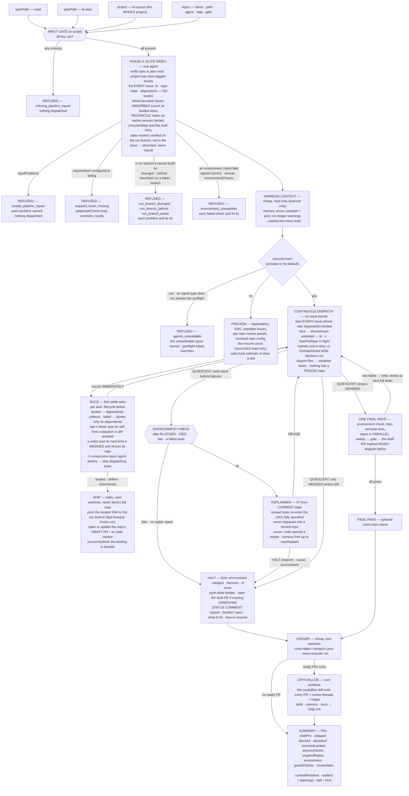
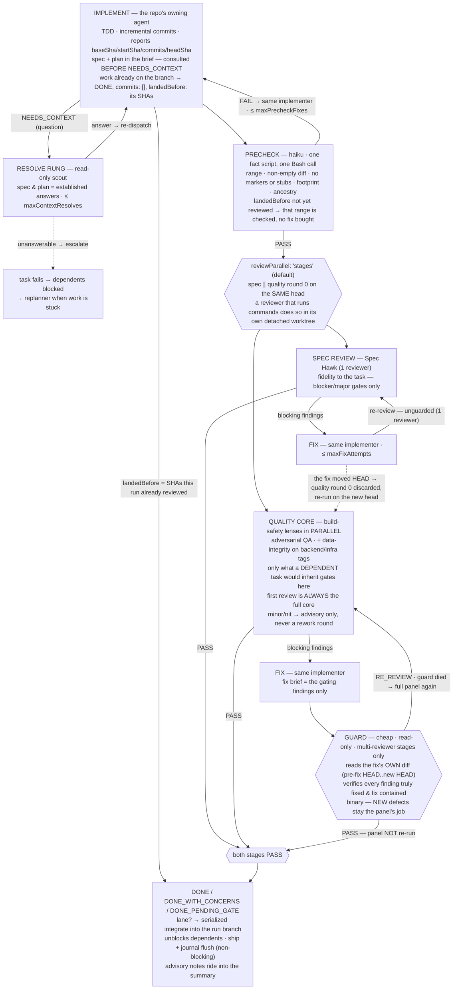
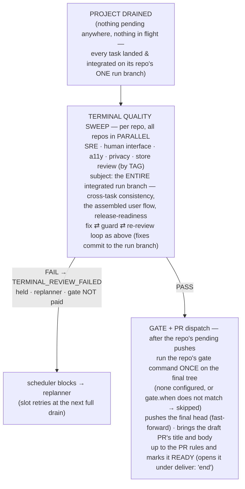

# orchestrate-loop — the unattended build loop

`roast` → `to-plan` → `to-issues` is the design half of the pipeline. This is the build
half, codified as a [dynamic workflow](https://code.claude.com/docs/en/workflows) script: it
takes the three artifacts the design half produced and runs the whole project to PRs on its
own — implementing each issue, reviewing it through a diverse-lens panel, pushing each landed
task to one draft PR per repo, gating the final tree and marking that PR ready, and learning
from what happened.

It is stack-agnostic. Every repo, agent, checkout path, gate command, tracker and directory
arrives through `args`; nothing about a language, framework, CI system or product is baked
into the script. The prose every dispatched agent reads lives next to it in `briefs/*.md` and
`personas/*.md`, so you can edit the behaviour without touching the engine.

## Install

Drop `workflows/orchestrate-loop.js` into `.claude/workflows/` (project) or
`~/.claude/workflows/` (personal), and put `briefs/` and `personas/` where you like — then
tell the script where they are with `{briefsDir, personasDir}`. Run it as `/orchestrate-loop`.

## Invoke

```js
/orchestrate-loop {
  specPath: 'docs/specs/2026-09-17-checkout-rework.md',   // from roast
  planPath: 'docs/plans/2026-09-17-checkout-rework.md',   // from to-plan
  project:  'PROJ-600',                                   // from to-issues
  repos: [
    { name: 'api',    agent: 'backend-engineer', tags: ['backend'],
      gate: { kind: 'command', run: 'make e2e ARGS=--wait', stamp: 'tests/e2e/.green' },
      timeoutMin: 60 },
    { name: 'mobile', agent: 'app-engineer',     tags: ['mobile'],
      gate: { kind: 'command', run: 'npm run smoke', stamp: 'native/.smoke-green',
              note: 'rebuild the vendored native artifacts and commit them first',
              when: { pathsMatching: ['native/', 'modules/native-bridge/'] } } },
    { name: 'infra',  agent: 'infra-engineer',   tags: ['infra'], gate: null },
  ],
  execute: true,   // omit for a preview — the default
}
```

**Previews by default.** Without `{execute:true}` the run stops after the index and returns
the dependency DAG, which issues are startable, the review panel each repo would draw, the
resolved repo config, the resume proof and a wall-clock `estimate`. Nothing else is dispatched,
and no branch is touched: the index's reconcile runs read-only. A forgotten or malformed flag
therefore fails safe.

The resume proof is what an execute run would take from the run's saved state ("Resume"
below), checked the same way: `resumedLanded` (each task verified on its run branch, with its
`headSha` and `source`, `checkpoint` or `pr`), `unverifiedLanded` (listed as landed but not
verified: built again), `stillToBuild`, and `branches`, per repo `{runBranch, sync, fetch,
local, remote, ahead, verified, prs}`, each PR with its marker's verdict (`verified`, `ignored:
<why>`, `none`, or `unread (freshStart)`). It is also one log line, `◎ resume: 2/3 landed,
verified on feat/proj-700-api @ bbbbbbb (checkpoint+pr) — still to build: PROJ-3`, and
`freshStart: true` when that is set.

The `estimate` covers only what is still to build (verified landed tasks are not counted, and
`basis` says so): `{tasks, criticalPath, repoSerial, largestRepo, perTaskMin, terminalMin,
startupMin, hours: {low, high}, basis}`. The critical path is the longest `dependsOn` chain
inside the project: a strict blocked-by chain runs one task at a time whatever `maxPerRepo`
is. `low` = (startup + max(critical path, ⌈largest repo ÷ maxPerRepo⌉) × per-task low +
terminal low) ÷ 60; `high` = (startup + max(critical path, largest repo) × per-task high +
terminal high) ÷ 60, because declared files are unknown at index level. The defaults (40–110
min per task, 30–90 min for the terminal review and gate, 10 min startup) come from measured
0.8.x runs; `estimatePerTaskMin` overrides the per-task bounds. A 10-issue chain in one repo
comes out at about 7–20 h; the real 0.8.0 run of that shape took about 29 h of run time over
three attempts. About 16.6 h of that went to a PreToolUse hook that timed out on every Bash
call, which the session probe (`maxToolLatencySec`, 0.8.1) now refuses, and 9–10 h to the
failures 0.9.0 removes ("Run durability"); the two overlap.

## Inputs

| Input | Required | What it is |
| ----- | -------- | ---------- |
| `specPath` | yes | the approved spec from `roast` |
| `planPath` | yes | the plan from `to-plan` |
| `project` | yes | the slice-tagged project or parent ticket from `to-issues` (an opaque id — Jira, Linear, GitHub Issues, or other) |
| `repos` | yes | the repo table; see below |
| `execute` | — | `true` to dispatch; default is a preview |

Missing any of the four → `missing_pipeline_inputs`, nothing dispatched. Failing the index
agent's verification (spec or plan absent/empty, no slice-tagged issues) →
`invalid_pipeline_inputs` via `inputProblems`. There are no fallback sources: a pre-extracted
task list would bypass `roast`, which is the point of requiring the artifacts.

### `repos[]`

| Field | Default | Meaning |
| ----- | ------- | ------- |
| `name` | — | the repo name the tracker issues use |
| `agent` | — | the subagent type that owns this repo's implementation |
| `path` | `repositories/<name>` | the checkout every command runs against |
| `tags` | `[]` | drives **persona selection**: `backend`, `mobile`, `web`, `infra`, or your own |
| `gate` | `null` | the command that certifies the final tree; see below |
| `timeoutMin` | the global `agentTimeoutMin` | a longer limit for this repo's writers (a gate that queues for a shared lock): it raises their soft limit and lifts their hard limit to at least twice its value. It only RAISES the global value: one at or under it has no effect, and the run logs so |
| `deliver` | the run's `deliver` | `'end'` keeps this repo's pushes for the terminal slot: a pre-push hook that demands the gate, or CI and previews too costly to run on every landing |
| `runBranch` | the run's `runBranch`, else derived | this repo's run branch, verbatim (two repos that share one checkout, a branch an earlier run used) |
| `laneSetup` | — | a shell line run when a parallel lane's worktree is created; `<lane>` is substituted with the worktree path (e.g. giving the lane its dependencies). Some bundlers refuse a symlinked `node_modules` that points outside the project root (Next.js 16's Turbopack does); clone it instead (`cp -cR`, copy-on-write on APFS) |

### `repos[].gate`

```js
gate: {
  kind: 'command',
  run: 'make e2e ARGS=--wait',        // run ONCE, on the final reviewed tree
  stamp: 'tests/e2e/.green',          // optional: a tree-hash stamp file the command writes
  note: 'rebuild X and commit first', // optional: extra instruction for the gate dispatch
  when: { pathsMatching: ['native/'] }, // optional: only gate when the RUN touched a match
}
```

`when.pathsMatching` is evaluated against everything the run touched **in that repo** —
planned `files` plus the `filesChanged` every implementer and every review fix reported —
because a pre-PR hook's unit is the whole branch, not one task. Absent means the gate always
runs. Matching is substring containment and deliberately loose: a false positive costs one
gate run, a false negative gets the PR blocked by your own hook.

`gate: null` means no gate command. Either way, implementers never push or open PRs. With
`deliver: 'incremental'` (the default) the loop pushes each landed head to the repo's run
branch and keeps ONE draft PR per repo up to date as tasks land ("Run durability" below); at
project end, after the quality sweep, the repo's terminal slot pushes the final head and marks
that PR ready (or opens it, under `deliver: 'end'`). (`prBy` was removed in 0.8.0 and is
ignored, with a warning.)

### Optional knobs

| Input | Default | Meaning |
| ----- | ------- | ------- |
| `maxPerRepo` | `3` | tasks in flight per repo (`1` restores strict serialization) |
| `maxFixAttempts` | `3` | fix rounds per review stage before it returns FAIL |
| `maxReplans` | `3` | replans charged to the run before it halts. The replanner names a `cause`: `code` (or none) spends one; `harness` (a late or wedged agent, silent reviewers) is free up to `maxReplans` times, then spends one; `environment` halts the run with `kind: 'environment'` and spends none. `0` turns replanning off |
| `maxContextResolves` | `2` | scout-answered `NEEDS_CONTEXT` questions per dispatch (`0` escalates immediately) |
| `agentTimeoutMin` | `40` | the SOFT limit per dispatch, in minutes (`0` disables every limit). Past it the dispatch is logged as late (event `late`, `telemetry.late`) and still awaited; a result that arrives later is accepted. An agent cannot be stopped, so a limit only decides how long the run waits. Mechanical kinds have shorter limits of their own (`timeouts`); `crystallize` has 90 minutes |
| `agentHardTimeoutMin` | `180` | where waiting ends. A reader (reviewer, verifier, guard, replanner, …) is given up on at twice its soft limit, capped by this value (`telemetry.timedOut`). A writer (implementer, fix, integrate, gate) is never settled while it may still be running: it is marked wedged, its repo is fenced (nothing else is dispatched into that checkout, no replan requeues into it) and its result is still taken when it arrives. When only wedged work is left, the run halts with `kind: 'wedged'`. `0`: writers never wedge |
| `timeouts` | — | per dispatch kind, `{<kind>: {soft, hard, hedgeAfter}}` in minutes. Defaults: `writer` (soft `agentTimeoutMin`, hard `agentHardTimeoutMin`), `reader` (hard 2 × soft, capped by the hard limit), `hydrate` (hard 90), `preflight` 2/6 (hedge at 2), `precheck` 6/15 (hedge at 6), `journal` 4/8, `ship` 5/12, `env` 2/4, `crystallize` 90/180. `hedgeAfter` starts one duplicate of a side-effect-free dispatch and takes the first non-empty reply: it applies to `preflight`, `precheck`, and `hydrate` when `claim` is off (no default for hydrate), and is ignored with a warning for any other kind. Unknown kinds are ignored with a warning |
| `deliver` | `'incremental'` | `'incremental'`: after each landing, push the landed SHA to the repo's run branch (fast-forward only, from a ship worktree, hooks never bypassed) and open or update its draft PR. `'end'`: nothing reaches the remote before the terminal slot. Per repo: `repos[].deliver` |
| `shipOnHalt` | `true` | on a halt, push what landed, open the draft PR if it is missing, and post a status comment on it (the reason, what landed, what is open, what to fix, how to resume), even under `deliver: 'end'` |
| `draftPr` | `true` | open the repo's PR as a draft after its first landing; `false` pushes without opening a PR before the terminal slot |
| `environmentChecks` | `[]` | `[{name, run, timeoutSec: 30, when: ['start', 'stall'], fix}]`: the project's own prerequisites (a browser the tests drive, a local service), checked like the built-ins; `fix` is what the refusal or halt tells the user to do. `run` is shell from config, trusted like `gate.run` |
| `builtinEnvChecks` | `true` | per repo, `commit:<repo>` (a signed empty commit in a scratch worktree, hooks skipped, thrown away) and `remote:<repo>` (`git ls-remote origin HEAD`), each under a portable time limit (`perl -e 'alarm …'`; stock macOS has no `timeout`); on macOS, `power` (on battery: a warning at start, again at a stall below 20%; never a refusal). See "Environment checks" |
| `runBranch` | derived from the project's key | the run branch, verbatim, in every repo (per repo: `repos[].runBranch`). Derived, it is `feat/<key>-<repo>`, where the key is the first ticket reference in `project` (see "Parallelism comes from declared files") |
| `reviewParallel` | `'stages'` | `'stages' \| 'all' \| 'off'`. `'stages'`: the precheck first, then spec and quality round 0 together on the same head; when a spec fix moves the head, the stale quality verdict is discarded and quality re-runs as `<persona>:<id>~h1`. `'all'`: the precheck runs alongside the reviewers too; a precheck FAIL discards both rounds and the stages then run in order. `'off'`: one after the other, as in 0.8.x. An unknown value warns and falls back to `'stages'`. Discarded rounds are journaled with `discarded: true` and a `reason`, and never count as a verdict |
| `hydrateAhead` | `2` | how many ready-next tasks are hydrated while their blockers are still in flight (`0`: just in time only) |
| `estimatePerTaskMin` | `{low: 40, high: 110}` | preview only: the minutes per task the wall-clock `estimate` assumes; a number sets both bounds |
| `maxToolLatencySec` | `15` | execute runs: the session probe refuses to start when a trivial Bash call waits this long before it runs (a PreToolUse hook hanging until its timeout, paid on every command of the run); from 8 s it warns. `0` never refuses |
| `memoryDir` | `memory` | `harness.md` + `agents/<agent>.md` |
| `runsDir` | `runs` | where run ledgers are written |
| `briefsDir` | `workflows/briefs` | where the dispatch briefs live |
| `personasDir` | `workflows/personas` | where the review lenses live |
| `worktreeDir` | `.worktrees` | where parallel lanes are checked out |
| `baseBranch` | `origin/main` | the integration branch lanes branch from and reviews/sweeps diff against (`origin/master`, `origin/trunk`, …) |
| `requireHook` | `null` | `{name, check, fix?, raw?}` — refuse to execute unless a tool hook is installed and registered in this session. `raw` (e.g. `'rtk proxy'`) is the prefix that runs a command with its output uncompressed: implement and gate prompts tell the agent to re-run a command as `<raw> <cmd>` when its output is empty, garbled or contradicts its exit code (without `raw`, the same rule without a command) |
| `skipHookCheck` | `false` | explicit, logged escape hatch for `requireHook` |
| `preflight` | `true` | execute runs: before any hydration or implementer, every agent type the run can dispatch (each project repo's owner, its enabled specialists, the reviewer, the resolve-rung scouts, the `finalCheck` agent) answers one trivial haiku prompt in parallel; a silent type is probed once more, and any still silent refuses the run as `agents_unavailable`, naming the types (`false` skips it) |
| `precheck` | `true` | the haiku structural check between implementer and panel (`false` disables) |
| `maxPrecheckFixes` | `1` | fix dispatches a precheck FAIL may buy before the task fails as `PRECHECK_FAILED` |
| `verifyFindings` | `true` | verify each gating finding against the code before a fix is bought (`false` disables) |
| `escalateAtFixRound` | `2` | from this fix round on, the implementer runs on opus whatever tier was chosen (`0` disables) |
| `specialists` | `[]` | `[{agent, repos: ['*'] \| [names], use}]` — implementers the selector may route a repo's tasks to instead of its owner |
| `agentNamespace` | `'grimoire'` | the prefix of the plugin-shipped agents (`agents/*.md`): the reviewer, the scouts, the `finalCheck` default and plugin specialists dispatch as `<ns>:<name>` (`grimoire:reviewer`). `''` keeps bare names, for a project that copied `agents/` into its own `.claude/agents/`. Repo/team agents, project-defined specialists and names that already contain `:` are used as given; memory stays at `agents/<bare name>.md` |
| `toolHints` | — | `{<capability>: <hint>}`, free-form and all optional, e.g. `{tracker: 'mcp__<server-id>__* (Linear, claude.ai connector)', design: 'mcp__<id>__* (Figma)', errors: '<error-tracker> CLI, already authenticated'}`. Pasted as a `## Tool hints` block into every dispatch header, as the first route of the shared tool-unavailable fallback (every brief's preamble: configured hint → another server/connector with the same capability via ToolSearch → an already-authenticated CLI/API → report every route tried). The older `tracker: {kind?, tools, note?}` still works and becomes `toolHints.tracker` |
| `maxOutputTokens` | — | cost fuse: this run's output tokens, counted across resumed sessions; reaching it halts as `budget_exhausted` |
| `budgetFloor` | `80000` | stop dispatching when the turn's remaining token budget drops below this |
| `claim` | — | `{identity}` — claim issues at hydration, never build one someone else started, release what did not land |
| `telemetry` | `{enabled: true}` | the decision journal: `{enabled, dir: '.grimoire/runs', flushEvery: 40}` (`retentionDays` is read by `/grimoire:logs`) |
| `runId` · `runMeta` | set by `/orchestrate` | the journal directory name, and `{grimoireVersion, briefsHash, personasHash, configHash}` every event of the run is tagged with |
| `resumeState` | — | the `checkpoint` of the run's newest local `run.json`. The engine also reads each run branch's PR state marker itself: the run-level counters (replans, fix rounds, sequence, spend) come from the newer of the two, the landed tasks from both, each absorbed only once its SHA is verified on the run branch; learnings come from `resumeState` only. See "Resume" |
| `freshStart` | `false` | `true` starts over on purpose: `resumeState` and every PR state marker are ignored, nothing is absorbed (landed work is built and reviewed again), the budgets start at zero, and no branch is created, moved or reset. An execute run refuses as `run_branch_exists` when origin already holds a run branch with commits not in the base: pass a `runBranch` origin does not have. A value that is not a boolean is ignored with a warning |
| `guard` | — | not read by the loop: the `PreToolUse` guard hook's config (`hooks/README.md`) |
| `graph` | `{enabled: true}` | not read by the loop: the code graph's config, `{enabled, repos?, dir: '.grimoire/graph', exclude?, maxFileKB: 512}` (`tools/graph/README.md`); scouts use it for research, never for what code does |
| `finalCheck` | `null` | `{repos:[…], prompt, agentType?}` — one read-only cross-repo check when every named repo landed work (e.g. API-contract drift between a client and its server) |

The canonical `requireHook` is [rtk](https://github.com/rtk-ai/rtk), which condenses every Bash result before it reaches an agent: `{ name: 'rtk hook claude', check: 'command -v rtk && rtk hook check "git status" | grep -q "^rtk "', fix: 'brew install rtk-ai/tap/rtk && rtk init -g', raw: 'rtk proxy' }`. A run that would dispatch dozens of agents without it reads raw output everywhere, so refusing is cheaper than running.

**The session probe** (execute runs) is the other side of hooks: the indexer makes two Bash
calls one after the other and reports how long the second waited, plus each checkout's root,
its current branch and `$HOME`. Every agent inherits the session's PreToolUse hooks, and a run
makes hundreds of Bash calls, so one hook hanging until its timeout costs hours that look like
slow builds: a six-task run once spent 6.4 of its 9.2 hours waiting on a 30-second hook before
every command. Past `maxToolLatencySec` the run refuses to start as `slow_tool_calls`; the
replanner always sees the measured number. The roots make every path the run publishes (the
ledger, the gate's PR body, crystallize's header) repo-relative, with the home directory as `~`.

## How a run flows


```mermaid
flowchart TB
    spec["specPath — roast"] --> gate
    plan["planPath — to-plan"] --> gate
    proj["project — to-issues (the WHOLE project)"] --> gate
    repos["repos — name · path · agent · tags · gate"] --> gate
    gate{{"INPUT GATE (in-script)\nall four set?"}}
    gate -- "any missing" --> ref1["REFUSED — missing_pipeline_inputs\nnothing dispatched"]
    gate -- "all present" --> idx["PHASE A: SLICE INDEX — one agent\nverify spec &amp; plan exist · project has slice-tagged issues\nlist EVERY issue: id · repo · state · dependsOn — NO bodies\ndone/canceled issues ABSORBED (count as landed deps)\nRECONCILE: tasks an earlier session landed (resumeState and the draft PR's\nstate marker) verified on the run branch, not in the base → absorbed, never rebuilt"]
    idx -- "inputProblems" --> ref2["REFUSED — invalid_pipeline_inputs\neach problem named · nothing dispatched"]
    idx -- "requireHook configured &amp; failing" --> ref3["REFUSED — required_hook_missing\n{skipHookCheck:true} overrides, loudly"]
    idx -- "a run branch it cannot build on\ndiverged · behind · freshStart on a taken branch" --> ref6["REFUSED — run_branch_diverged ·\nrun_branch_behind · run_branch_exists\neach problem and its fix"]
    idx -- "an environment check fails\nsigned commit · remote · environmentChecks" --> ref5["REFUSED — environment_unavailable\neach failed check and its fix"]
    idx --> ctx["HARNESS CONTEXT — cheap, read-only (execute only)\nmemory stores verbatim + prior run-ledger learnings\n→ pasted into every brief"]
    ctx --> exec{"execute:true?\n(preview is the default)"}
    exec -- "yes · an agent type does not answer the preflight" --> ref4["REFUSED — agents_unavailable\nthe unresolvable types named · {preflight:false} overrides"]
    exec -- "no" --> prev["PREVIEW — dependency DAG, startable issues,\nper-repo review panels, resolved repo config,\nthe resume proof (reconciled read-only),\nwall-clock estimate of what is left"]
    exec -- "yes" --> disp["CONTINUOUS DISPATCH — no wave barrier\nstart EVERY issue whose own dependsOn landed\nslice → downstream-unlocked → id · ≤ maxPerRepo in flight\nhydrate just-in-time, or hydrateAhead while blockers run\ndisjoint files → worktree lanes · nothing into a FENCED repo"]
    disp --> race["RACE — first settle wins\nper task: lifecycle below\nlanded → dependents unblock · failed → blocks only its dependents\nlate ≠ dead: past its soft limit a dispatch is still awaited\na writer past its hard limit is WEDGED and fences its repo\n3 consecutive quick agent deaths → stop dispatching, drain"]
    race -- "rescan IMMEDIATELY" --> disp
    race -- "landed · deliver: incremental" --> ship["SHIP — haiku, own worktree, never blocks the loop\npush the landed SHA to the run branch (fast-forward, hooks run)\nopen or update the repo's DRAFT PR + its state marker\njournal flushed: the landing is durable"]
    disp -- "QUIESCENT: work stuck behind failures" --> envq{{"ENVIRONMENT CHECK\nafter BLOCKED · DIED · late · a failed push"}}
    envq -- "ok" --> replan["REPLANNER — A* from CURRENT state\nrevised tasks re-enter the DAG fully specified\nnever requeues into a fenced repo\ncause: code spends a replan · harness free up to maxReplans"]
    envq -- "fails · no replan spent" --> halt
    replan -- "REVISE" --> disp
    replan -- "HALT (reason) · cause: environment" --> halt["HALT — kind: environment · wedged · harness · or none\npush what landed · open the draft PR if missing (shipOnHalt)\nSTATUS COMMENT: reason · landed / open · what to fix · how to resume"]
    disp -- "QUIESCENT: only WEDGED writers left" --> halt
    halt --> ledger
    disp -- "QUIESCENT: project DRAINED" --> final["ONE FINAL WAVE — environment check, then terminal slots,\nrepos in PARALLEL: sweep → gate → the draft PR marked READY\ndiagram below"]
    final -- "slot failed → held, retries at next full drain" --> disp
    final -- "all green" --> check["FINAL PASS — optional cross-repo check"]
    check --> ledger["LEDGER — cheap, own worktree\nruns/&lt;date&gt;-&lt;project&gt;.json · every execute run"]
    ledger -- "ready PRs exist" --> cry["CRYSTALLIZE — own worktree\nthe crystallize skill over every PR + review threads + ledger\nskills · memory · docs → ONE PR"]
    ledger -- "no ready PR" --> summary
    cry --> summary["SUMMARY — PRs · draftPrs · shipped · blocked · absorbed · resumedLanded ·\nadvisoryNotes · ungatedRepos · environment · guardChecks · reviewStats ·\ncontextResolves · replans + learnings · halt + kind"]
```

Replans, terminal slots and halts happen **only at quiescence** (nothing in flight, or nothing
in flight but wedged writers) — the coherence a wave barrier used to provide, without its idle
time. A token-budget floor stops dispatching, lets in-flight work settle, then halts cleanly.
A repo with a failed task is never gated while that failure stands, even when nothing depends
on the task: the environment check and the replan come first, and the repo gates (its PR
marked ready) only once the failure has been replanned and landed, while repos without a
failure gate as usual. If the replan halts or the budget is spent, the repo stays a draft: with
nothing else left, the halt names each task that did not land and its repo (`exhausted replan
budget (3) — PROJ-4 (api) QUALITY_FAILED did not land; api not gated`), and the status comment
says why. A halt pushes what landed and comments on the repo's draft PR; any repo it left
without its gate and ready PR is listed in `ungatedRepos`. Re-invoking `/grimoire:orchestrate` on the same
project resumes from the saved state ("Resume" below); the tracker alone cannot, because its
issues close only when the PR merges.

### One task's lifecycle


```mermaid
flowchart TB
    impl["IMPLEMENT — the repo's owning agent\nTDD · incremental commits · reports baseSha/startSha/commits/headSha\nspec + plan in the brief — consulted BEFORE NEEDS_CONTEXT\nwork already on the branch → DONE, commits: [], landedBefore: its SHAs"]
    impl -- "NEEDS_CONTEXT (question)" --> scout["RESOLVE RUNG — read-only scout\nspec &amp; plan = established answers · ≤ maxContextResolves"]
    scout -- "answer → re-dispatch" --> impl
    scout -. "unanswerable → escalate" .-> esc["task fails → dependents blocked\n→ replanner when work is stuck"]
    impl -- "landedBefore = SHAs this run already reviewed" --> done
    impl --> pre["PRECHECK — haiku · one fact script, one Bash call\nrange · non-empty diff · no markers or stubs · footprint · ancestry\nlandedBefore not yet reviewed → that range is checked, no fix bought"]
    pre -- "FAIL → same implementer · ≤ maxPrecheckFixes" --> impl
    pre -- "PASS" --> par{{"reviewParallel: 'stages' (default)\nspec ∥ quality round 0 on the SAME head\na reviewer that runs commands does so in its own detached worktree"}}
    par --> specr["SPEC REVIEW — Spec Hawk (1 reviewer)\nfidelity to the task — blocker/major gates only"]
    par --> qr["QUALITY CORE — build-safety lenses in PARALLEL\nadversarial QA · + data-integrity on backend/infra tags\nonly what a DEPENDENT task would inherit gates here\nfirst review is ALWAYS the full core\nminor/nit → advisory only, never a rework round"]
    specr -- "blocking findings" --> fixs["FIX — same implementer · ≤ maxFixAttempts"]
    fixs -- "re-review — unguarded (1 reviewer)" --> specr
    fixs -. "the fix moved HEAD → quality round 0 discarded,\nre-run on the new head" .-> qr
    specr -- "PASS" --> both{{"both stages PASS"}}
    qr -- "PASS" --> both
    both --> done
    qr -- "blocking findings" --> fix["FIX — same implementer\nfix brief = the gating findings only"]
    fix --> guard{{"GUARD — cheap · read-only · multi-reviewer stages only\nreads the fix's OWN diff (pre-fix HEAD‥new HEAD)\nverifies every finding truly fixed &amp; fix contained\nbinary — NEW defects stay the panel's job"}}
    guard -- "PASS — panel NOT re-run" --> both
    guard -- "RE_REVIEW · guard died → full panel again" --> qr
    done["DONE / DONE_WITH_CONCERNS / DONE_PENDING_GATE\nlane? → serialized integrate into the run branch\nunblocks dependents · ship + journal flush (non-blocking)\nadvisory notes ride into the summary"]
```

### The final wave


```mermaid
flowchart TB
    drained["PROJECT DRAINED\n(nothing pending anywhere, nothing in flight —\nevery task landed &amp; integrated on its repo's ONE run branch)"]
    drained --> sweep["TERMINAL QUALITY SWEEP — per repo, all repos in PARALLEL\nSRE · human interface · a11y · privacy · store review (by TAG)\nsubject: the ENTIRE integrated run branch — cross-task consistency,\nthe assembled user flow, release-readiness\nfix ⇄ guard ⇄ re-review loop as above (fixes commit to the run branch)"]
    sweep -- "FAIL → TERMINAL_REVIEW_FAILED\nheld · replanner · gate NOT paid" --> replan["scheduler blocks → replanner\n(slot retries at the next full drain)"]
    sweep -- "PASS" --> gate["GATE + PR dispatch — after the repo's pending pushes\nrun the repo's gate command ONCE on the final tree\n(none configured, or gate.when does not match → skipped)\npushes the final head (fast-forward) · brings the draft PR's title and body\nup to the PR rules and marks it READY (opens it under deliver: 'end')"]
```

The sweep runs **before** the gate so its fix commits land before any tree-hash stamp is
paid. A sweep or gate failure is a regular failure: the replanner can queue a repair task, and
the slot retries at the next full drain.

## Why it is shaped this way

**Reviews are split by scope.** A landed task unblocks its dependents, so per-task review
gates exactly what a dependent would inherit: fidelity (Spec Hawk) plus a build-safety core
(adversarial QA, and data-integrity on backend/infra-tagged repos). The polish and compliance
lenses judge the *integrated* feature, so they run once per repo, at project end, over the
whole run branch. Implementation never pays a gate.

**Severity is the gate, not the verdict flag.** Only `blocker` and `major` buy a rework
round — each one is a full implementation dispatch. `minor` and `nit` are collected and
reported in `advisoryNotes`, never reworked. A reviewer that returns FAIL with no finding at
all is unverifiable, so it gates anyway, carrying its summary as a synthesized major.

**The guard exists because re-reviews are expensive.** The first review of a stage is always
the full panel; after a fix, one cheap agent reads the fix's own diff and either passes the
stage or sends it back to the panel. It is binary on purpose — finding *new* defects stays the
panel's job.

**Failures are information.** A failed issue blocks only its dependents. When the scheduler is
stuck, the replanner searches from the current state rather than restarting the original plan,
and returns `learnings` that are folded into every later hydration and into the run ledger the
next run reads. See the `adaptive-replanning` skill. The replanner also names the failures'
`cause`, and only a code cause spends the replan budget: an environment cause (a hung tool or
hook, a locked commit signer, a machine asleep) halts the run with `kind: 'environment'`,
because requeuing the same work into the same machine fails the same way, and a harness cause
(a late or wedged agent, silent reviewers) is free up to `maxReplans` times, then charged, so a
harness loop still ends; a HALT it decides on a harness cause carries `kind: 'harness'`.
Silent reviewers never reach the replanner at all: when a reviewer of a stage returns nothing,
that persona alone is retried once; if any lens is still missing, the stage fails closed and the
run halts as `reviewers unavailable`, naming the lens — no replan is spent and the task is
reported `REVIEWERS_UNAVAILABLE`, never as failed review and never passed on the surviving
reviewers.

**Parallelism comes from declared files.** `dependsOn` decides what is *ready*; declared
`files` decide what may run *together* in one repo. Disjoint footprints get their own worktree
lane; overlap, or an undeclared footprint, is held until the conflict clears. A task running
alone in its repo works directly on the repo's run branch — never on its tracker branch. The
run branch is named `feat/<key>-<repo-slug>`, deterministically, so every session of a run (a
resume included) builds on the same one. The key is the first ticket reference in `project` —
`owner/repo#N`, else `#N` (as `issue-N`), else a Jira/Linear-style `ABC-123`, else a tracker
URL's id (a GitHub issue URL counts as `owner/repo#N`) — and the whole project text only when it
holds none (accents folded, other characters collapsed to dashes; nothing sluggable left becomes
`x<hash>`). A 0.8.0 run's project was a sentence, so its branch was too, and a relaunch worded
differently would have built on another branch and missed its PR: now `acme/site#3`
and a sentence that starts with it share `feat/acme-site-3-<repo>`. `runBranch` names
it outright. Lane merges into
the repo's single run branch are serialized, and a merge conflict is a first-class
`MERGE_CONFLICT` failure routed to the replanner — a reviewed diff is never silently
rewritten.

**Progress is kept on the remote and on disk, not in the session.** A 0.8.0 run of ten
issues built seven of them over about 29 hours and three attempts and opened no PR: every
halt threw away what the session knew, and nothing had been pushed. Each landing is now
pushed to a draft PR and flushed to the journal as it happens, so a halt, a kill or a new
session starts from what landed ("Run durability" below).

## The rungs added around the panel

**Precheck.** Between the implementer and the first review, one haiku dispatch
(`briefs/precheck.md`) checks that there is something reviewable: a commit range, a non-empty
diff, no conflict or stub markers added, tests moved with behaviour, no undeclared files, no
stray artifacts, and — for a task committed directly onto the run branch — that its head is
reachable from that branch, so work on a stray branch fails fast instead of settling DONE.
The range it (and the panel) judges is `startSha..headSha`, where the implementer started,
so a merge task is not blamed for the files of every lane merged before it. The precheck
verifies that `startSha` is an ancestor of the head (check `range`); if not, the engine drops
it and judges from `firstSha^` instead, without buying a fix. When the same
footprint-only problems come back with no commit in between, they are recorded as advisory
notes and the panel runs: another fix cannot change that answer. A FAIL goes back to the same implementer (`maxPrecheckFixes`), before any
reviewer is paid. A dead precheck passes through — it is an optimisation, not a gate. The
precheck prompt embeds one fact script (commit count, `--name-status`, added conflict and stub
markers, oversized files, the ancestry checks) and the agent judges every check from its
output in one Bash call: per-call latency, not the checks, made prechecks take 5–13 minutes.

**Work already on the branch.** An implementer that finds its task already done (an earlier
session, or a predecessor that ran past its time limit and committed) verifies it and returns
`DONE` with `commits: []`, `startSha = headSha`, and `landedBefore`: the SHAs that implement
it. SHAs this run already reviewed land the task with no precheck and no panel (`absorb`
event, `reviewed-earlier`); unreviewed ones are prechecked and reviewed as that range, and no
"no change" fix is ever bought. With no `landedBefore`, an empty range is a precheck FAIL as
before.

**Parallel review stages.** With `reviewParallel: 'stages'` (the default), spec and quality
round 0 run together on the same head once the precheck passes, so a task waits for the
slower stage instead of both: the common case is that every round-0 review passes (the 0.8.0
run's journal had 32 review events and no FAIL). A spec fix that moves the head discards the
quality verdict and re-runs it on the new head (`<persona>:<id>~h1`). Every reviewer, verifier,
guard and sweep reviewer that runs a build or a test does it in its own detached worktree at the
reviewed head, `<worktreeDir>/review-<task>-<persona>…` (`git worktree add --detach`, with the
repo's `laneSetup` applied), never in the shared checkout: two reviewers building there once
emptied each other's build output. The precheck reads git only and gets none; the gate removes
any `review-*` worktree a dead reviewer left behind before it runs.

**Hydration ahead.** In a blocked-by chain the next task used to be hydrated only after its
blocker landed, on the critical path (6–43 minutes each in the 0.8.0 run). With `hydrateAhead`
(default 2) the next ready tasks are hydrated while their blockers are still in flight; the
implementer is told which blockers landed after its task was hydrated and checks the code
before relying on a fact from it. A replan in that repo drops prefetched hydrations so they
pick up its learnings.

**Harness findings in the terminal sweep.** A blocker or major the terminal sweep finds in a
harness file (`grimoire.config.json`, `.claude/`, `AGENTS.md`, the memory and runs
directories, `docs/crystallize/`) does not buy a fix round on the product branch: it is kept as
an advisory note tagged `harness` and listed in crystallize's header, which fixes it in the
harness PR. A per-task review still gates a task's own change to such a file.

**Finding verification.** Every failing review round sends its gating findings to one sonnet
verifier (`briefs/verify.md`) before a fix is bought. A finding is overturned only when the
verifier cites the code that proves it false; overturned findings are reported in
`overturnedFindings`, never reworked. A dead verifier keeps every finding.

**The selector.** Hydration already reads each issue in full, so it also routes it: `agent`
(the repo's owner, or a specialist enabled for that repo) × `model` (haiku · sonnet · opus by
the rubric in `briefs/hydrate.md`) with a `routeReason`. The engine accepts only an agent the
routing table allows — anything else is dispatched as the owner, counted as a fallback — and
escalates to opus from `escalateAtFixRound` and for a task replanned after a CODE failure
(gating findings, an implementer that could not do it, a structural precheck defect); a
replan after a HARNESS failure (a dead agent, a merge conflict, a footprint or ancestry
precheck) keeps the chosen tier. A gate or terminal-sweep failure is a code failure, and a
task the replanner invents inherits the kind of the failures it repairs in its repo. Only review fix
rounds count toward escalation; a precheck fix is structural and does not. `NEEDS_CONTEXT`
questions go to the scout their shape calls for: contract → `contract-checker`, security →
`security-scout`, performance → `perf-scout`, otherwise `codebase-scout`.

**Learnings by relevance.** Learnings are stored as `{text, repos}`. Each hydration carries
at most 12: those about its own repos first, then pipeline-wide ones — not the last N of
everything. Older ledgers' bare strings are tagged with that ledger's repos.

**Claims.** With `claim.identity`, the index reports each issue's assignee; an issue someone
else has started is never dispatched (its dependents wait, `claimedElsewhere` says why);
hydration assigns the issues it is about to build (a replan that re-enters an unclaimed
tracker issue claims it through `briefs/claim.md`); at the end one dispatch
(`briefs/claim.md`) hands back every claimed issue that did not land.

**Cost fuse.** `maxOutputTokens` is checked before every dispatch, counting what earlier
sessions of the same run spent. At 80% the run logs a warning; at the cap it stops
dispatching, lets in-flight work settle and halts as `budget_exhausted`. The script only
sees output tokens (`budget.spent()`); input and cache tokens are not visible to it.

## Run durability

A long unattended run has to survive agents that run late, a machine that stops cooperating
and a session that ends, without losing or redoing work. A 0.8.0 run of ten issues in a
strict chain took about 29 hours of run time over three attempts, built seven slices and
opened no PR; about 9–10 of those hours were wasted on the failures below (and much of every
hour on a hanging hook: "Runtime constraints").

**Late is not dead.** An agent cannot be cancelled ("Runtime constraints"): a time limit only
decides how long the run waits. In 0.8.x a dispatch past the 40-minute backstop was booked
DIED while it kept working: two implementers booked dead kept going, for 78 and 115 minutes in
all, and committed their slices, and a replan re-dispatched one task into the checkout its
predecessor was still writing. Every dispatch now has a soft and a hard limit for its kind
(`agentTimeoutMin`, `agentHardTimeoutMin`, `timeouts`):

- at the soft limit the dispatch is logged as late (`late`) and still awaited, and its result
  is accepted when it comes (`late-result`, `accepted: true`). For a writer, a non-blocking
  environment check runs: a `git commit` hung on a locked signing agent looks exactly like a
  late writer. `telemetry.late` keeps each late dispatch's outcome: `accepted`, `died` (it
  returned nothing after all), `abandoned` (a reader given up on at its hard limit), `wedged`
  or `pending`;
- at the hard limit a reader is given up on (`telemetry.timedOut`). A writer is not: it is
  marked wedged (`wedged`) and its repo is fenced (`fence`), so nothing is dispatched or
  requeued into that checkout. The task keeps its slot until the agent returns, then carries
  on with that result (precheck, review). When nothing but wedged writers is left, the run
  halts with `kind: 'wedged'`, and the reason says the agent may still commit. A writer that
  returns after the run stopped dispatching is recorded (`late-result`, `accepted: false`) and
  not used: its task goes no further. A terminal slot whose gate or fix wedges does not hold
  the final wave: the other slots are booked, its repo stays out of the next wave and of
  dispatch, and its result is booked when it returns (still in the result if the run has
  ended by then), so its gate never runs twice;
- a lane that passed its review while its repo's primary checkout is fenced is not merged: it
  settles `FENCED`, a harness failure, with its worktree and lane branch left in place. The
  replanner never requeues it while the fence holds; once it is released, a retry of the same
  id resumes in that worktree;
- the side-effect-free kinds start one duplicate at their `hedgeAfter` (`hedge`) and take the
  first non-empty reply: preflight at 2 minutes, precheck at 6, and hydration when claims are
  off and `timeouts.hydrate.hedgeAfter` is set;
- a hydration that returns nothing is retried once (`hydrate:w<N>~r1`) before the run halts;
  a late one is accepted (one took 43 minutes and halted a 0.8.0 run);
- only quick deaths count toward the three-deaths circuit breaker; late, wedged and hedged
  dispatches never do.

**Incremental delivery.** Under `deliver: 'incremental'` (the default) each landing enqueues
a ship for its repo: one haiku dispatch (`briefs/ship.md`) that works in its own worktree,
`<path>/<worktreeDir>/ship-<repo>`, checked out at the landed SHA (so a pre-push hook checks
exactly the pushed tree, away from the next implementer), and

- pushes that exact SHA to the run branch, fast-forward only
  (`git push origin <sha>:refs/heads/<runBranch>`): never `--force`, never `--no-verify`, and
  the next task's unreviewed commits are never published;
- opens the repo's draft PR after its first landing (`gh pr create --draft`) and rewrites its
  body as tasks land: a banner (built unattended, each task
  reviewed, not ready to merge), the exact resume instruction (re-run `/grimoire:orchestrate`
  on the same spec, plan and project; it finds this PR's saved state), the landed tasks — each
  with its closing keyword (`Closes #N` on GitHub or GitLab issues, the bare key for Jira or
  Linear), title, head SHA and "passed spec and quality review" — what is still open, and,
  as its last line, a hidden state marker, `<!-- grimoire:state v1 <base64 JSON> -->`, holding
  the run's state ("Resume" below). The body is built by the engine and passed base64, so
  implementer text never reads as an instruction.

The ship script and the reconcile (below) reach the PR through `gh` and nothing else: without
it, or on a forge `gh` does not serve, pushes still go on, but no draft PR is opened
(`failedStep: 'pr'`, then PR updates stop) and no marker is read back, so a resume relies on
the local `run.json` alone. The gate is an agent and may use the forge's own CLI.

Ships for one repo are chained and coalesce (a queued ship pushes the latest landed head);
they never block the loop. A ship failure never halts, replans or marks code failed. A push
that fails twice in a row, or a pre-push hook that demands the gate, stops incremental pushes
for that repo (`shipped.<repo>.disabled: 'push'`; set `repos[].deliver: 'end'` to skip the
attempt); a failed PR step stops only the PR updates. The terminal slot waits for the repo's
pending ship, then the gate pushes the final head and marks the PR ready.

On a halt (`shipOnHalt`), every repo with landed work and no green terminal slot pushes its
last landed head if the remote lacks it (never a live writer's branch tip: a wedged halt pushes
only what was reviewed), gets its draft PR if it has none (`draftPr`), the halt banner, and a
status comment: the reason, what to fix first (the environment failure and its fix, or "let the
agent still running finish"), the landed tasks with their SHAs, what is still open, any wedged
agent, and how to resume. A repo the run leaves ungated without a halt (a terminal slot that
failed with no replan left) gets the same. A repo whose terminal slot is still running (a gate
past its hard limit) is skipped and logged: that gate pushes, retitles and marks the PR ready
itself, and a halt banner written meanwhile would contradict it. The halt's script also
removes the reviewers' leftover `review-*` worktrees; mid-run, a ship only prunes the records of
deleted ones, because a live `review-*` worktree belongs to a reviewer working in it. Each push
triggers the remote's CI and previews: visible progress, or a cost; `deliver: 'end'` opts a
repo out.

**Environment checks.** The machine can stop cooperating mid-run: a commit-signing agent that
locks, an SSH agent that hangs. In the 0.8.0 run an implementer found the locked signing
agent halfway through a task, and a replan spent about eight minutes diagnosing it before it
halted. The built-in checks
(`commit:<repo>`: a signed empty commit in a scratch worktree, thrown away; `remote:<repo>`:
`git ls-remote origin HEAD`) and the project's `environmentChecks` run as a fixed script, each
check under `perl -e 'alarm <s>; exec @ARGV'` (exit 142 = timed out; stock macOS has no
`timeout`), through one haiku dispatch (`briefs/env.md`) that reports each
`CHECK <name> EXIT <code>` and runs nothing else:

- **at start**, inside the index: any failure refuses the run as `environment_unavailable`,
  naming each check and its fix, before anything is hydrated;
- **after a stall** (a BLOCKED, DIED, ERROR or FENCED task, a writer past its soft limit, or a
  failed push), before the
  next replan and before the final wave: a failure halts with `kind: 'environment'` and a reason
  that says what to fix, e.g. "environment: commit:api timed out after 30 s (signed commit in a
  scratch worktree; gpg.format=ssh, gpg.ssh.program=…) — unlock or approve the commit-signing
  agent …, then resume". No replan is spent and no code is marked failed;
- **in flight**: the check that settles after a stall runs while other tasks keep going; a
  failure stops new dispatches at once, and the run halts once in-flight work settles.

At start, only a repo the project touches can refuse the run (a configured repo it never builds
in is reported). The stall check covers the repos in play and the `environmentChecks` whose
`when` has `stall`; one runs at a time, and a stall check that returns nothing is not a failure.
The `power` check reads `pmset -g batt` where it exists (macOS): on battery it warns at start,
and again at a stall below 20% — a laptop that sleeps or hibernates turns every agent late (a
real run lost 49 minutes on battery at 1%) — and never refuses or halts.

**Resume.** A run's saved state lives in two places, both rewritten on every landing: the
`checkpoint` in `<telemetry.dir>/<runId>/run.json` (local) and the state marker in the repo's
draft PR (on the remote, so another machine can continue). The tracker is not one of them: its
issues close only when the PR merges, so landed-but-unmerged work still looks open there.

- **Where the state comes from.** `/grimoire:orchestrate` finds the project's newest local
  `run.json` (by `updatedAt`), reuses its `runId` and passes its `checkpoint` as `resumeState`,
  to the preview first and then to the execute run; on a machine without one it passes none.
  The engine reads every run branch's PR marker itself, in the index. The run-level counters
  (attempt, replans and fix rounds used, the journal's sequence, output tokens spent) come from
  the newer of `resumeState` and the verified markers, by attempt, then `lastSeq` (a tie goes to
  `resumeState`), so the budgets continue rather than reset; the landed tasks come from both;
  learnings come from `resumeState` only.
- **The reconcile.** One fixed script inside the index (`briefs/index.md`), POSIX sh that runs as
  it is under bash, zsh and dash. Per repo, in parallel, it fetches the run branch, lists the
  branch's PRs and checks every listed task against the branch and the base. Each fetch and `gh`
  call has a 30-second limit and the whole script a 90-second deadline (the Bash tool allows
  120 s); a repo still running then is stopped and named in a `WARN` line. It prints a `BRANCH`
  line per repo (`local`, `remote`, `sync`: `same`, `ahead`, `created`, `fast-forwarded`,
  `behind`, `diverged`, `local-only`, `remote-only` or `missing`; `fetch=ok|failed`; and
  `ahead=<n>`, the commits origin's run branch holds that the base does not), a `PR` line per
  PR of the branch from this same repository (a fork's PR is never read; open first, then
  newest, at most three, and only the first carrying a marker prints it, raw, with its length
  and `cksum`), and a `TASK` line per listed task (`local`, `origin`, `onBranch`,
  `inBase=yes|no|unknown`, `first`, `firstOk`). In an execute run it creates a missing local run
  branch from origin and fast-forwards one strictly behind, in a clean checkout only; it never
  resets, rebases or discards a commit. In a preview and under `freshStart` it is read-only.
- **What is absorbed.** A task whose head is on the run branch (the local one; origin's when
  only origin has it, or in a preview when the local one is behind) and not in the base
  (`inBase=no`), and whose first commit, when recorded, passes the same test. A diverged branch
  absorbs nothing, nor does a base that does not resolve in the checkout (set `baseBranch`), nor
  a head that is gone (a reset branch): each is logged and built again (`unverifiedLanded` in a
  preview). An absorbed task (`absorb` event; `resumedLanded`, with `source: 'checkpoint'` or
  `'pr'`) seeds the landed set, the replanner's DONE list, the gate's PR body and the terminal
  sweep, and its head and first commit count as reviewed for that task, on that run branch,
  only: reviewed SHAs are per task, so one task can never cite another's.
- **A PR marker is trusted only as far as it is verified**, because anyone who can edit a PR
  body can write one. The copy the index agent returns must match the length and `cksum` the
  script printed; the marker must name its project (by key, unless the run branch is set
  explicitly), its repo and its run branch, all equal to this run's; only ids of this project's
  index are absorbed; its counters are clamped (output tokens above `maxOutputTokens`, or above
  10⁹ without a cap, count as 0; replans at most `maxReplans`; fix rounds at most 3 ×
  `maxFixAttempts` + `maxPrecheckFixes`, for this project's issues only); and no text of it
  reaches a prompt (it carries no learnings, summaries, commits or files, and its titles never
  name a task). A repo whose verified marker says its PR is out of draft (open or merged) was
  shipped by its terminal slot: unless new work lands there, the slot is not paid again.
- **A run branch the run cannot build on refuses the launch**, before anything is hydrated. For
  a repo with work left, a branch that diverged from origin is `run_branch_diverged`; one behind
  origin that could not be fast-forwarded (uncommitted changes, or the branch checked out in
  another worktree), or only on origin and not created locally, is `run_branch_behind`.
  `problems` says how to fix each, and nothing landed is lost: it is verified again on the next
  launch. A failed fetch (offline) is a warning, and every other sync state is logged. A remote
  run branch that lacks the last absorbed head gets it shipped at start.
- **`freshStart: true`** starts over on purpose: no `resumeState`, no marker read, nothing
  absorbed, the budgets at zero, and every branch left exactly as it is. Its first push has to
  fast-forward origin's run branch, so for a repo with work it refuses as `run_branch_exists`
  when origin holds the run branch and the reconcile cannot show it holds nothing past the base
  (`ahead=0`): pass a `runBranch` origin does not have, or close the earlier run's PR and delete
  its branch first. A preview logs that it would refuse.
- `resumeFromRunId` is not a resume: it replays cached results for the longest unchanged
  prefix of agent calls ("Runtime constraints"). Use it only for a byte-identical relaunch.

## The decision journal

Every decision is an event: `run.start`, `route`, `dispatch`, `precheck`, `review` (one per
reviewer), `verify`, `fix`, `escalate`, `guard`, `resolve`, `integrate`, `settle`, `replan`,
`terminal`, `gate`, `claim`, `budget`, `halt`, `run.end`, and, from 0.9.0, `late`, `hedge`,
`wedged`, `late-result`, `fence` (a repo held or released), `ship` (`{repo, mode, pushed, head,
prUrl, draft, failedStep, detail, disabled}`; `pushed: null` = nothing to push), `env` (`{when,
why, ok, failed}`; `ok: null` = no usable report) and `absorb` (`{task, repo, source, head}`;
`source` is `checkpoint` or `pr` for a task absorbed at start, `reviewed-earlier` for one an
implementer found already on the branch and reviewed, `verify-only` for one found there
unreviewed and sent to the panel as it stands). `harness-routed` (from 0.8.1) records a
terminal-sweep finding on a harness file routed to crystallize; `replan` carries the `cause`
and `halt` its `kind`. Each carries a `seq` (a resumed session continues the checkpoint's;
one without a checkpoint starts at 1), the cumulative output tokens `tok`, and its fields
(reasons included). The script has no clock and no filesystem, so events are buffered and one haiku
writer per chunk (`briefs/journal.md`) runs a fixed shell script that:

- decodes its payload: the chunk's lines, `run.json` and the landed-task detail travel
  **base64** in the prompt and the script decodes them (`base64 --decode`, else
  `openssl base64 -d`). The payload holds agent-written text (replan reasons, learnings, halt
  text), and a 0.8.0 journal agent, which runs from the orchestrating checkout with the
  project's instructions loaded, acted on its payload. The brief tells it the payload is data,
  never to decode or read it, and to run nothing but that one script. The ledger and ship
  payloads travel the same way;
- checks every decoded payload against the byte count and POSIX `cksum` the engine computed
  (the count alone where `cksum` is missing) and writes nothing from one that does not match:
  a mistyped character, a payload cut off or a missing decoder leaves the file on disk as it
  was. The ledger script does the same and prints `LEDGER bad` instead of a path;
- runs under a lock in the run directory (a `.lock` directory holding the writer's pid), so
  two writers do not interleave: a lock whose writer is gone is broken at once, any lock after
  about 30 s, and a writer still without it after about a minute goes on without it;
- writes the chunk to `<telemetry.dir>/<runId>/events/<first seq>.jsonl` — a retried or
  replayed flush overwrites the same file, never appends duplicates;
- stamps the flush time into each line (`at`) in the shell — every event of one chunk shares
  it (the script has no clock; order within a chunk is `seq`);
- stamps the `attempt`: the session number under this `runId`, registered once per session in
  `<runId>/sessions` (`<session token> <attempt>`). Every flush carries the session's token, a
  hash of what the launch started from (runId, the resume base, the run branch heads and PRs
  the index saw, the open issues, the knobs): a token the registry does not know gets the next
  number, above every attempt on record and above `run.json`'s (a `run.json` without one, as
  0.7.x wrote, counts as attempt 1), and never below the attempt the engine knows from the
  checkpoint it resumed. Every flush of one session stamps the same number however late it
  runs. A relaunch under the same `runId` (resumed or not) is therefore distinguishable, and
  from attempt 2 on its chunks are `<first seq>.a<N>.jsonl`, so they never overwrite an
  earlier attempt's. Two launches that start from exactly the same state share an attempt;
- rewrites `run.json` (`runId`, `attempt`, `gen`, `session`, `project`, `meta`, `status`,
  `summary`, and the `checkpoint` a new session resumes from) through a temp file and an atomic
  `mv`, only when this flush is not older than the one on disk: ordered by `gen` (the attempt
  the engine knows from the checkpoint it resumed, else the attempt), then by `lastSeq`. A late
  flush never rolls back a newer checkpoint, whatever order the writers run in;
- appends the detail of each task that landed since the last confirmed flush (its full record:
  `id`, `repo`, `status`, `ticket`, `title`, `runBranch`, the SHAs, `commits`, `summary` up to
  400 characters, `files` up to 50, with `attempt` and `at`) to `<runId>/landed.jsonl`, once;
- prints the line and byte counts of the decoded chunk, `RUNJSON ok|kept|bad` with
  `RUNJSON_BYTES`, and `LANDED ok <n>`, which the engine compares with what it sent: a mismatch
  is logged and counted (a refused `run.json` as a lost write, `telemetry.journal.runJsonLost`),
  never trusted, and an unconfirmed landed delta is sent again with the next flush.

A writer that returns nothing loses its chunk (`telemetry.journal.lost`, and `lostEvents`).
After two lost in a row the writer is marked dead: later chunks are counted lost without being
dispatched, since each would otherwise wait out its 8-minute limit at the end of the run, and
only the final chunk (`run.end` and the final `run.json`) gets one more attempt.

The checkpoint is version 2: `{version: 2, attempt, replansUsed, learnings, fixRounds,
outputTokensSpent, lastSeq, landed, pending, landedTasks, shipped}`. It travels in every flush
and the writer retypes it, so it keeps only what a resume needs: each of `landedTasks` is `{id,
repo, runBranch, headSha, firstSha, title}` (`status` when not `DONE`, `title` up to 120
characters; tracker-absorbed issues are not in it), `learnings` are the last 30, each
`{text, repos}` up to 300 characters, and `shipped` is `{<repo>: {pushedHead, prUrl, draft}}`.
`landed` and `pending` are id lists. A resume absorbs from `run.json` alone; summaries and paths
are enrichment (an absorbed task without paths makes a conditional gate apply). A 0.8.x
checkpoint (no `version`) still resumes its budgets; it has no SHAs, so nothing is absorbed from
it. `summary` is written at the end: `{done, failed, stillRunning, recovered, blocked, prs,
tokens, replans, halt, prUrls}`, where `halt` is `{reason, kind}` (`kind` null when the halt has
none), like the `halt` event.

The draft PR's state marker is not the checkpoint. It is one line,
`<!-- grimoire:state v1 <base64 JSON> -->`, per repo: `{version: 2, runId, project, repo,
runBranch, base, attempt, lastSeq, replansUsed, fixRounds, outputTokensSpent, landedTasks}`,
with `fixRounds` for that repo's tasks and each landed task as `{id, headSha, firstSha?,
title?}` (`firstSha` only when it differs from the head, `title` up to 120 characters). It
holds at most 40 tasks and 8,000 characters of base64, because the index agent copies it back
verbatim: titles are shortened to 40 characters, then dropped, before the newest tasks are left
out (`omitted` counts them); a task left out is not absorbed from the PR, so on another machine
it runs again, finds its work on the branch (`landedBefore`) and is reviewed as it stands. It
carries no learnings, summaries, commits or files: detail stays in the local `run.json` and
`landed.jsonl`.

Chunks flush every `flushEvery` events, on every landing and after each ship, at every
replan, before the final wave and at the end (before the ledger, so `crystallize` can read the
finished journal). A landing is on disk minutes after it happens, not at the next flush
forty events later. The directory is
local and gitignored; `/grimoire:logs` renders it, and its `summary` is the cross-run evidence
`crystallize` reads, grouped by grimoire version and briefs hash.

## What it returns

`done` · `needsAttention` (the latest attempt of each task or slot that never landed; a writer
still running at its hard limit is listed as `STILL_RUNNING`, a lane held behind a fenced
checkout as `FENCED`) ·
`recovered` (attempts that failed before the same task landed after a replan, or before its
repo gated green: history, not work) · `blocked` (never ran) · `alreadyDone` (absorbed) · `deferred` ·
`advisoryNotes` (the minor/nit findings not reworked, plus any repeated footprint-only
precheck problems demoted to advisory, plus terminal-sweep findings on harness files tagged
`harness` — triage them by hand) · `ungatedRepos`
(landed work with no ready PR yet; its log line names the draft PR) · `ungatedReasons` (repo → why a certified tree was not shipped:
the push or PR step failed; never replanned, push it by hand) · `prs` (ready PRs only: crystallize
runs over these) · `draftPrs` (repo → the draft PR the loop opened as tasks landed) · `shipped`
(repo → `{pushedHead, prUrl, draft, disabled}`: what reached the remote, and whether incremental
pushes or PR updates were turned off) · `resumedLanded` (tasks absorbed from an earlier session,
verified on the run branch, each with `source: 'checkpoint' | 'pr'`) · `environment` (`{checks,
failures, warnings}`: the checks that ran, each failure with its fix, the power warnings) ·
`replans` (the ones charged to `maxReplans`) + `learnings` + `halt` (`{reason, kind}`; `kind:
'environment'` is the machine and `'wedged'` a writer still running, neither failed code;
`'harness'` is a replanner that halted on a harness cause; most halts have none) · `contextResolves`
(every `NEEDS_CONTEXT` question, who answered it, which escalated — a high count means the
spec was underspecified, take it back to `roast`) · `guardChecks` · `reviewStats` ·
`precheckStats` · `overturnedFindings` · `routing` (picks by agent and model, fallbacks,
escalations) · `claimedElsewhere` · `claimsReleased` · `meta` · `telemetry` (output tokens,
this run's spend against `maxOutputTokens`, the session probe's `toolLatencySec`, `late` (each
dispatch past its soft limit, `{label, kind, softMin, outcome: 'accepted' | 'died' |
'abandoned' | 'wedged' | 'pending'}`), `wedged` (the writers past their hard limit), `timedOut`
(the readers given up on at their hard limit), and `journal`, the writer's receipt: `{runDir,
events, written, chunks, mismatches, lost, lostEvents, runJsonLost}`) · `harness` (the ledger
written and what crystallize produced; when PRs shipped but crystallize did not finish, the
`note` says to run it by hand over them).

A preview returns the plan instead (see "Previews by default"). A start-up refusal returns
`{error, …}`: `missing_pipeline_inputs`, `parse_failed` (the index returned nothing),
`invalid_pipeline_inputs`, `required_hook_missing`, `slow_tool_calls`, `run_branch_diverged`,
`run_branch_behind` or `run_branch_exists` (each with `problems` and `branches`, the per-repo
branch view), `environment_unavailable` (`problems: [{name, exit, output, fix}]`), or
`agents_unavailable`.

The run stops at PRs. Merging and deploying stay yours.

## Tests

The scripts only run inside the Workflow runtime, where every step costs real agents. The
tests reimplement the runtime's contract (`agent`, `parallel`, `log`, `phase`, `args`,
`budget`) with scripted stubs, so the whole control flow executes in milliseconds and asserts
the actual dispatches — which agents ran, in what order, with which prompt.

```sh
for t in workflows/tests/*.test.mjs; do node "$t"; done
```

Their repos are fixtures (`api`, `mobile`, `infra`), not product facts. Add a case by calling
`run(name, tasks, responder)` and returning whatever each dispatch should have returned.

## Runtime constraints worth knowing

The script has **no filesystem or shell access** — agents read, write and run commands; the
script only coordinates them. It cannot call `Date.now()`, `Math.random()` or `new Date()`
(the runtime makes them throw so a relaunched run replays identically), and it cannot
`import()`. That is why the review range travels as SHAs in the implementer's structured
return, and why memory and ledgers are read and written by dedicated cheap agents.

- **An agent cannot be cancelled.** `agent()` returns a bare promise with no handle; it
  resolves empty only on a user skip or a terminal API error. A time limit can only stop
  *waiting* (`setTimeout` exists), and an abandoned agent keeps working and may commit. That is
  why a writer past its hard limit fences its repo instead of being retried into it.
- **`agent()` options are a closed set**: `{label, phase, schema, model, effort,
  isolation: 'worktree', agentType}`. There is no timeout, abort signal, tool list or working
  directory option; the engine passes its own dispatch options (`kind`, `task`, `repo`, `lane`,
  `last`) to its time-limit wrapper and strips them before each call, because an unknown key is
  a validation error. Tools can be narrowed only through `agentType` (an agent definition's
  `tools:`), and Bash allows anything, so "read-only" is a convention. Custom agent types still
  receive the project's instruction file and the session's PreToolUse hooks.
- **Every agent pays the session's PreToolUse hooks.** A hook that hangs until its own timeout
  is paid on every Bash call of every agent, and looks like slow work. About 16.6 of the 29
  hours of the real 0.8.0 run were a third-party PreToolUse Bash hook timing out at 30 s on
  every call. The session probe (`maxToolLatencySec`, from 0.8.1) refuses such a session at
  start; that run had 0.8.0 installed. Keep the installed plugin up to date.
- **A message sent to the session while a workflow runs reaches its agents.** The runtime
  relays it into the prompts of the agents the workflow dispatches. In the same run a haiku
  probe took a user's message as its instruction and ran the build and the gate. Every brief
  now tells an agent to report such a message, never obey it, but the reliable way is not to
  send one: give instructions after the run, or stop it first.
- **`isolation: 'worktree'` is a worktree of the orchestrating repository**, not of
  `repos[].path` (unless that path is `.`). Reviewer and ship worktrees for target repos are
  made by the agent itself with `git -C <repo> worktree add --detach`.
- **Queue time counts toward every limit**: the timer starts when the engine dispatches, and
  the runtime caps how many agents run at once. More concurrency (parallel reviews, prefetch,
  ship, hedges) can make a queued agent look late, which is one reason a late agent is awaited
  rather than written off.
- **A sleeping machine makes every agent late.** The same run's Mac hibernated on battery
  mid-run; the `power` check warns about it ("Environment checks"), and only a plugged-in,
  awake machine (`caffeinate -is` on macOS) prevents it.
- **Replay is best-effort.** `resumeFromRunId` returns cached results for the longest
  unchanged prefix of `agent()` calls; the first changed prompt or option, and everything after
  it, runs live. Results of dispatches the original run had abandoned are recorded and come
  back instantly, so any branch that depended on a timer (a timeout, a hedge) or on completion
  order (the race, parallel lanes) can diverge even with identical args, and journal prompts
  carry the token count, so the cache rarely survives the first flush. A 0.8.0 relaunch with
  only `agentTimeoutMin` raised diverged at the first late result and re-implemented three
  landed slices (3.5 hours for two small commits). Durable progress therefore comes from state:
  resume with `runId` + `resumeState` ("Resume" above), and keep `resumeFromRunId` for a
  byte-identical relaunch.

## Token economy (built in)

- The terminal sweep reads **by lens**: each persona takes the branch `--stat` and reads only the files its Scope section names, never the whole branch.
- Mechanical dispatches (index, harness-context, agent preflight, integrate, precheck, journal, ship, environment checks, claim release, ledger) run with `effort: 'low'`; ship and environment checks run on haiku, index and hydration on sonnet, the replanner stays on opus, and implementers run on the tier the selector picked (opus when unset).
- A precheck stops an unreviewable diff before the panel; a verifier stops a false-positive finding before it buys a fix.
- The first review of a stage is the full panel; after a fix a sonnet guard decides whether the panel re-runs.
- Briefs and memory are pasted as a stable prefix so prompt caching hits across dispatches; volatile values (task, SHAs) come last.
- `requireHook` (rtk) refuses to execute without output compression.
- After a halt, a kill or in a new session, resume by state: the same `runId` and `resumeState` from a fresh `run.json` (the engine reads the draft PR's state marker itself). Landed tasks are absorbed once verified on the run branch and the budgets carry over; nothing landed is built again. `resumeFromRunId` replays cached results only for a byte-identical relaunch.
